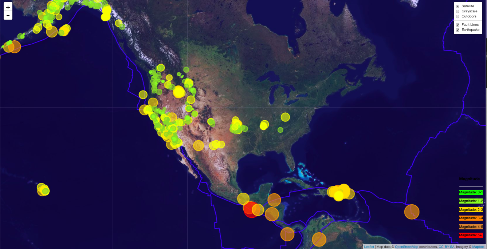

# Leaflet---Visualizing-Data-with-Leaflet

Access websit by clicking link
https://elisu87.github.io/Leaflet---Visualizing-Data-with-Leaflet/

#### Dataset 

-  Data set from http://earthquake.usgs.gov/earthquakes/feed/v1.0/geojson.php
-  Data on tectonic plates can be found at https://github.com/fraxen/tectonicplates.

#### Technologies 

- Leaflet
- html
- Java
- CSS 

#### Description

- Imported & Visualized the Data

  - Created a map using Leaflet that plots all of the earthquakes from your data set based on their longitude and latitude.
  - Included popups that provide additional information about the earthquake when a marker is clicked.
  - Created a legend that will provide context for your map data.

#### Visualization 

